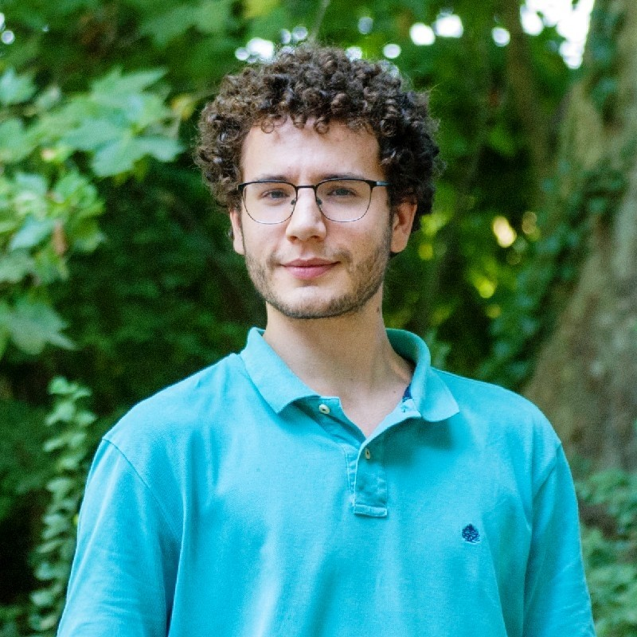
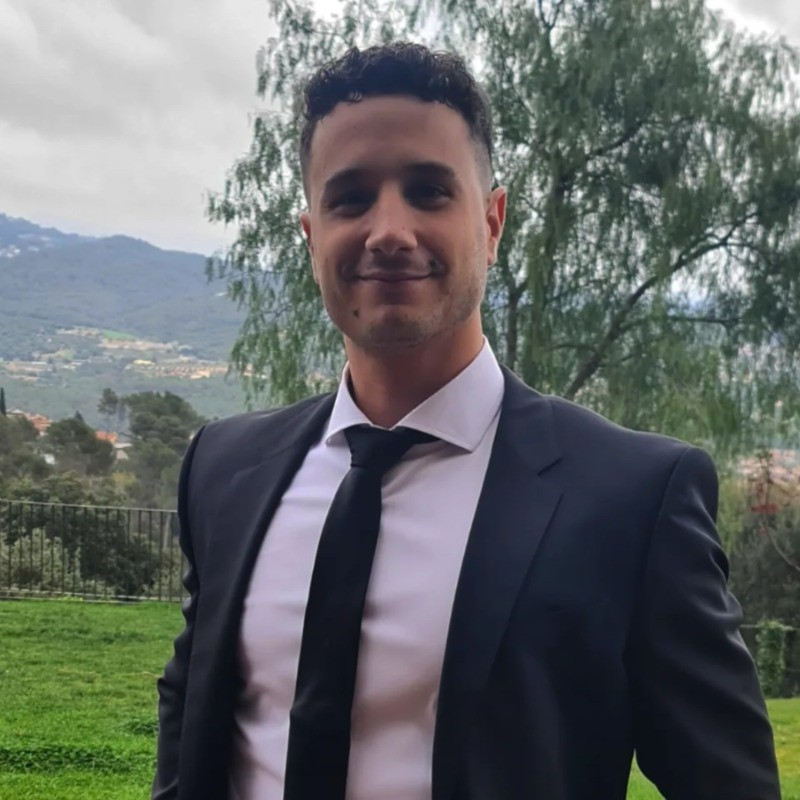

# Who we are

Two brothers, one vision:

**Create a data driven decision world**

**[Roger Brascó](https://www.linkedin.com/in/rbrasco/)**, his journey in technology began at the age of 12 with basic HTML and CSS. Over the years, he has
expanded his skillset to include programming languages such as Python, Bash, C, and Javascript. As a lover of logical
and
abstract thinking, he pursued a degree in Mathematics at the University of Barcelona. Currently, he is working as a
Junior
DevOps Engineer, focusing on learning, improving, and becoming proficient in cloud technologies.

**[Oriol Brascó](https://www.linkedin.com/in/brascooriol/)** pursued a degree in Aeronautical Engineering at the Universitat Politècnica de Catalunya and he is
currently working as an Analytics Product Owner at GE Vernova, leading the development of data-driven
solutions that can predict potential failures, maintenance dates, misalignments, and other failure points of turbines,
introducing innovative techniques when possible. He also led a continuous improvement monitoring for the detection of
possible defects or the development of new features for the existing analyses, implementing an analysis life cycle
capable of adapting to a constantly changing world.

With more than seven years of experience in software development and data analysis, he has a strong background in
Python, SQL, AWS, and machine learning. He has applied his skills and knowledge to various projects in the fields of
renewable energy, industrial machinery, and automotive testing, delivering high-quality applications that improve the
interaction and performance of clients and products. Proactive, fast-learning, and autonomous, as well as a team player.
His interests include fluid dynamics, computer vision, artificial intelligence, cryptocurrencies, and data analysis.
During his spare time, he enjoys riding his motorcycle, skiing, scuba diving, and experimenting with new experiences.

# Vision

**Business Segments:**

- Business Applications
- Cloud & Infrastructure
- Cyber Security
- Data & Analytics
- SAP
- Software Development

**Services:**

- **Consulting**
- **Technology Solutions**
- **Project Management**

## **Mission Statement**

At Rho Beta Solutions, our mission is to empower a sustainable future by providing innovative energy and technology
solutions that transform the way we live and work.

## **Core Values:**

1. **Innovation:** We prioritize innovation in everything we do, from developing new technologies to improving existing
   ones.
2. **Sustainability:** We are committed to reducing our environmental footprint and promoting sustainability in all
   aspects of our business.
3. **Excellence:** We strive for excellence in everything we do, whether it's delivering high-quality products or
   services or building strong relationships with our customers.
