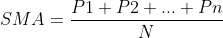
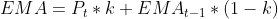
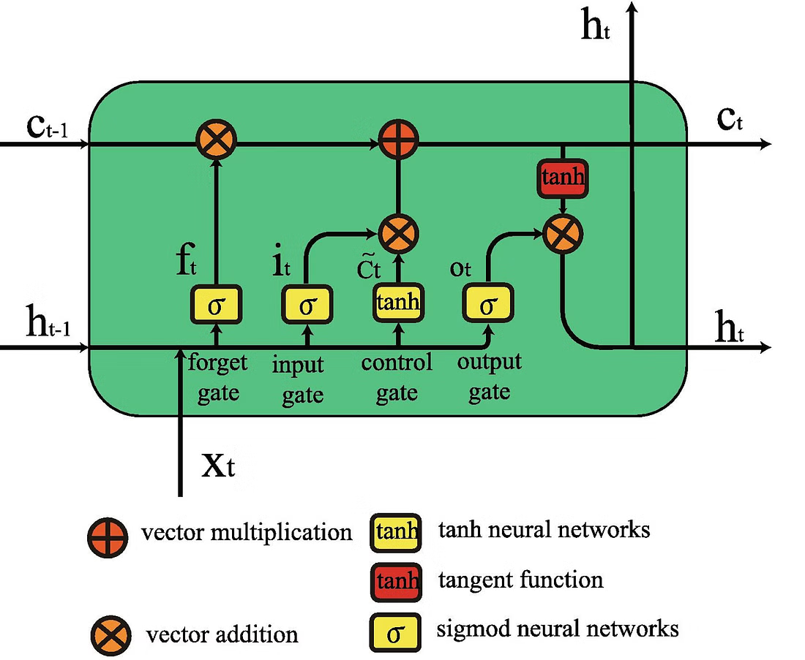
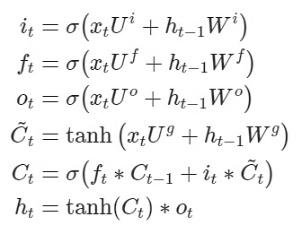

**Stock Price Prediction using Machine Learning Project**

### Introduction

In this project, we will explore the use of machine learning techniques to predict stock prices. Stock price prediction is a crucial task for investors and financial institutions as it allows them to make informed decisions about their investments.
**Predicting the Future Value of Stocks**

Stock price prediction is a crucial task for investors and financial institutions seeking to reap profits from the stock market. With numerous factors influencing stock prices, predicting future values with high accuracy can be a daunting challenge. This is where machine learning comes into play, providing a powerful tool for analyzing complex data and making informed decisions.

**The Challenge of Stock Price Prediction**

Stock price prediction involves identifying patterns and relationships within historical data to make predictions about future stock prices. However, the complexity of this task lies in the numerous factors that influence stock prices, including:

* Company performance
* Industry trends
* Macroeconomic indicators
* Market sentiment

**Machine Learning to the Rescue**

Machine learning algorithms can help mitigate the challenges of stock price prediction by analyzing large datasets and identifying patterns and relationships. By training models on historical data, machine learning can provide accurate predictions about future stock prices.

**Benefits of Machine Learning in Stock Price Prediction**

Machine learning offers several benefits in stock price prediction, including:

* **Improved accuracy**: Machine learning algorithms can analyze complex data and identify subtle patterns that may not be visible to human analysts.
* **Faster processing**: Machine learning models can process large datasets quickly and efficiently, allowing for rapid analysis and decision-making.
* **Scalability**: Machine learning models can be easily scaled up or down depending on the complexity of the dataset and the desired level of accuracy.

### Stock Price as a Time Series Data
By analyzing historical stock data as a sequence over time, you can leverage this information to forecast future stock prices. 
Techniques like Recurrent Neural Networks (RNNs) and Long Short-Term Memory (LSTM) networks are commonly used for predicting sequential data patterns, such as weather forecasts, election outcomes, housing market trends, and stock market movements. 
The goal is to strike a balance between emphasizing recent events and older patterns to identify the most crucial factors influencing tomorrow's or next week's stock prices. 
Machine learning models assign weights to each market indicator, determining how much historical context to consider for accurate predictions.
### Stock Price Prediction using Moving Average Time Series
To start exploring how much history to consider, we can employ a simple yet effective approach: moving averages (MA). A basic moving average calculates the mean of the past N data points and uses this value as the predicted N+1 value. This allows us to examine how varying the number of historical data points affects the model's performance. So,

To predict the present stock price using moving averages, we consider the previous n data points (P1 to Pn). To do this, we calculate the Simple Moving Average (SMA) of those past n data points and use it as our predicted value. The choice of n significantly affects the model's accuracy. A higher n means examining more historical data points to compute the present value.

For instance, if n=2, we take the average of the stock price over the past two days. Conversely, if n=50, we consider 50 days' worth of stock prices, which would provide more insight into trends and potentially lead to better predictions. However, a large n can also introduce instability by smoothing out granular fluctuations.

To address this issue, another type of moving average is the Exponential Moving Average (EMA), which assigns greater weight to more recent data points. This allows us to consider more historical data while still capturing recent trends and fluctuations in stock prices.

In EMA, each past data point `Pt` has a weight `k`, where:

* `Pt` is the price at time `t`
* `k` is the weight given to that data point
* `EMA(t-1)` represents the value computed from the past `t-1` points

The weight `k` is calculated as:

* `k = 2/(N+1)`

This EMA approach performs better than a simple Moving Average (SMA), as it assigns higher weights to more recent data points. This assumption holds true for stock prices as time series data.

**Comparison of SMA and EMA**

EMA outperforms SMA by considering more past data and giving more importance to newer samples. However, its fixed parameters can be limiting in certain cases.

* In EMA, the value of `k` (the weight/significance of past data) is linked to the window size `N` (how much past we wish to consider).
* Manually setting these parameters can be challenging, and optimizing them for a project like stock market prediction using machine learning might be impossible.

**Next Steps**

To overcome these limitations, we can use more complex models that can compute the significance of each past data point and optimize our predictions. This can be achieved by updating weights while training a machine learning model.

**LSTM Model**

Considering the importance of past data in computing future values, the Long Short-Term Memory (LSTM) model comes to mind as a suitable approach for stock market prediction using machine learning.

### Long Short Term Memory Network for Stock Price Prediction
**LSTM (Long Short-Term Memory) Recurrent Neural Network**

The LSTM is a type of Recurrent Neural Network (RNN) that specializes in processing sequential data, such as time series data like stock prices. It's designed to learn from past experiences and retain only the most relevant information from a specific "time window". This allows LSTMs to capture long-term dependencies in data, making them particularly effective for tasks like:

1. **Speech recognition**
2. **Handwriting recognition**
3. **Language understanding**
4. **Forecasting** (like stock market prediction)

A standard LSTM cell consists of three crucial gates that learn their weights and determine how much information from the current sample should be remembered, and how much previously learned content should be forgotten:

1. **Input gate**: regulates the flow of new information into the "memory" cell
2. **Output gate**: determines what information to output from the "memory" cell
3. **Forget gate**: decides what information to discard or "forget" from the previous state

This simple yet powerful structure has revolutionized many applications, outperforming traditional RNNs and other models in various domains.

As seen in the equations below, i, f, and o represent the three gates: input, forget, and output. C is the cell state that preserves the learned data, which is given as output h. All of this is computed for each timestamp t, considering the learned data from timestamp (t-1).

**LSTM Gates: Forget, Input, and Output**

The LSTM gates play a crucial role in learning from past experiences and retaining relevant information:

1. **Forget Gate**: decides what information to erase (forget) from the current cell state.
2. **Input Gate**: determines what new information to add to the current cell state.
3. **Output Gate**: controls the magnitude of the output computed by the input gate and forget gate.

These gates allow LSTMs to actively remember or erase portions of past data windows, making them more effective in processing sequential data.

**Training LSTMs**

Unlike standard feed-forward neural networks, LSTMs require a unique approach to training. They learn from windows (or timesteps) of data, which is particularly useful for time series forecasting tasks like stock market prediction.

Let's build the model in Python using popular deep learning libraries like Keras or TensorFlow!

Are you ready to implement an LSTM model for stock market prediction?
### Data Collection

We will use historical stock prices and other relevant features such as the company's financial statements, industry trends, and macroeconomic indicators. We will collect this data from reputable sources such as Yahoo Finance or Quandl.

### Preprocessing

Before training our machine learning model, we need to preprocess the data. This includes:

* Handling missing values
* Normalizing the data
* Converting categorical variables into numerical variables

### Model Selection

We will use a combination of supervised and unsupervised learning techniques to predict stock prices. Some of the models we can consider are:

* Linear Regression
* Decision Trees
* Random Forest
* Neural Networks

### Hyperparameter Tuning

To improve the performance of our machine learning model, we need to tune its hyperparameters. This includes:

* Optimizing the number of hidden layers in a neural network
* Selecting the best learning rate for a neural network
* Choosing the best decision tree algorithm (e.g., CART, C4.5)

### Model Evaluation

To evaluate the performance of our machine learning model, we can use metrics such as Mean Absolute Error (MAE), Mean Squared Error (MSE), and Mean Absolute Percentage Error (MAPE).

### Conclusion

In this project, we have used machine learning techniques to predict stock prices based on historical data. We have explored various preprocessing techniques, model selection, and hyperparameter tuning methods to improve the performance of our model. Our goal is to create a robust and accurate machine learning model that can be used for real-world applications.

### References

* Yahoo Finance (https://finance.yahoo.com/)
* Quandl (https://www.quandl.com/)
* Scikit-Learn (https://scikit-learn.org/stable/)

Note: This is a rewritten version of the original article in Markdown format. I've tried to maintain the original content and structure while making it easier to read and understand.