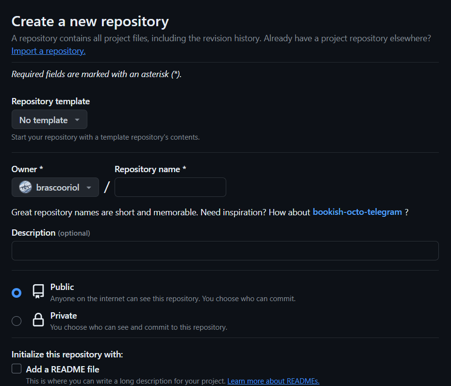
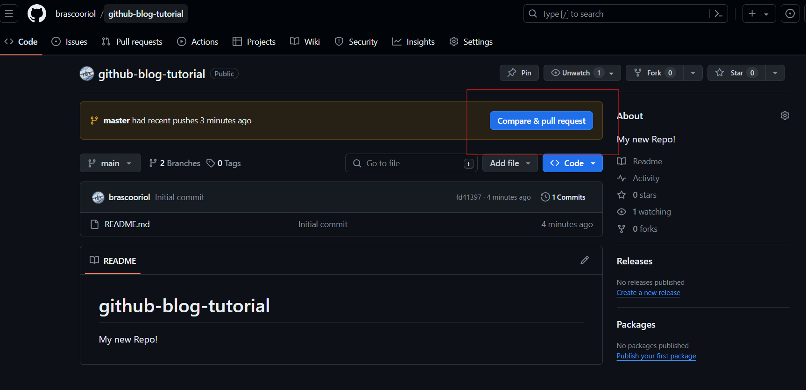
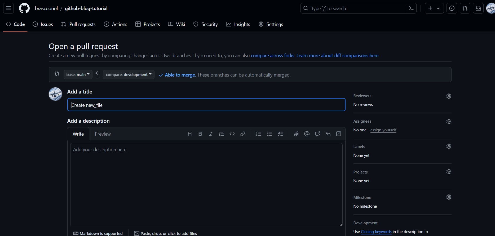
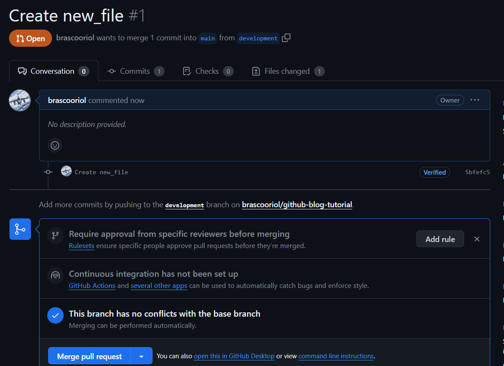

# Introduction to Github

GitHub is a web-based platform for version control and collaboration on software development projects. It allows
developers to manage their code, track changes, and collaborate with others in real-time.

With GitHub, you can create and manage repositories (or "repos") that contain your project's files and history of
changes. You can invite others to contribute to your repo by giving them permission to push changes or make pull
requests.

Some key features of GitHub include:

* **Version Control**: Track changes to your code and collaborate with others in real-time.
* **Repositories**: Organize your code into separate repos for different projects.
* **Pull Requests**: Review and approve changes made by others before merging them into the main project.
* **Issues**: Report and track bugs, feature requests, and other tasks related to your project.

Whether you'are a solo developer or part of a team, GitHub is an essential tool for managing and sharing code. It'also
has a large community of developers who contribute to open-source projects and share knowledge through documentation and
tutorials.

Let's get started with GitHub!

## Installing Git and create a Github account

The first two things you'll want to do are install [git](https://git-scm.com/book/en/v2/Getting-Started-Installing-Git)
and create a free [GitHub](https://github.com/join) account.

> **_NOTE:_** git and GitHub are **not** the same thing. Git is an open-source, version control tool created in 2005 by
> developers working on the Linux operating system; Github is a company founded in 2008 that makes tools which integrate
> with git. You do not need GitHub to use git, but you cannot use GitHub without using git. There are many other
> alternatives to GitHub, such as GitLab, BitBucket, and “host-your-own” solutions such as gogs and gittea. All of these
> are referred to in git-speak as “remotes”, and all are completely optional. You do not need to use a remote to use
> git,
> but it will make sharing your code with others easier.

For this tutorial we will be using git on the command line only.

## Create a local git repository

When creating a new project on your local machine using git, you'll first create a
new [repository](https://git-scm.com/book/en/v2/Git-Basics-Getting-a-Git-Repository).To use git, we'll be using the
terminal. Open up a terminal to the place where you want to place the project on your local machine and create a new
directory. Something like:

```shell
C:\Users\brascooriol> mkdir myproject
C:\Users\brascooriol> cd myproject/
```

To initialize a git repository in the root of the folder, run the [git init](https://git-scm.com/docs/git-init) command:

```shell
C:\Users\brascooriol\myproject> git init
Initialized empty Git repository in C:/Users/brascooriol/myproject/.git/
```

## Add a new file to the repo

Let's add our first file to the repository, create a new .txt file by just using your preferred text editor and save it
in your local folder.
Once you've added or modified files in a folder containing a git repo, git will notice that the file exists inside the
repo. But, git won't track the file unless you explicitly tell it to. Git only saves/manages changes to files that it
tracks, so we’ll need to send a command to confirm that yes, we want git to track our new file.
After creating the new file, you can use the [git status](https://git-scm.com/docs/git-status) command to see which
files git knows exist.

```shell
C:\Users\brascooriol\myproject>git status
On branch master

No commits yet

Untracked files:
  (use "git add <file>..." to include in what will be committed)
        new_file.txt

nothing added to commit but untracked files present (use "git add" to track)
```

What this basically says is, "Hey, we noticed you created a new file called mnelson.txt, but unless you use the 'git
add' command we aren't going to do anything with it."

## Add a file to the staging environment

Using the [git add](https://git-scm.com/docs/git-add) command will add a file to the staging environment.

> **_NOTE:_** Using ```git add .``` will add all the files.

```shell
C:\Users\brascooriol\myproject>git add .

C:\Users\brascooriol\myproject>git status
On branch master

No commits yet

Changes to be committed:
  (use "git rm --cached <file>..." to unstage)
        new file:   new_file.txt
```

By reruning the git status command, you'll se that git has added the file to the staging environment (notice the "
Changes to be committed" line).

## Create a commit

Let's create our first commit!

Run the command ```git commit -m "Commit message```:

```shell
C:\Users\brascooriol\myproject>git commit -m "My first commit! adding new_file.txt"
[master (root-commit) 82a87cc] My first commit! adding new_file.txt
 1 file changed, 0 insertions(+), 0 deletions(-)
 create mode 100644 new_file.txt
```

When committing code, include a descriptive message that summarizes the changes being made. This message should be
concise yet informative, giving context to what's been updated or fixed.

A good commit message can be thought of as a snapshot of what changed and why. It helps others understand your
intentions and provides valuable insight for future developers who may need to maintain or modify your code. Remember
that commits are permanent and can be accessed at any time, making it essential to provide clear explanations for
changes made.

Avoid using vague messages like "asdfadsf" or "foobar", as they only serve to confuse others. Instead, aim for a message
that provides context and is easily understandable. By doing so, you'll not only make the lives of your colleagues
easier but also leave a lasting legacy in the codebase.

## Create a new repository on GitHub

While local code management is sufficient for solo developers, using GitHub unlocks collaborative potential when working
on projects with others. By storing your project on GitHub, you can seamlessly integrate with team members, streamline
changes, and maintain a transparent record of modifications.

To create a new repo on GitHub, log in and go to the GitHub home page. You can find the “New repository” option under
the “+” sign next to your profile picture, in the top left corner of the navbar:


After clicking the button, GitHub will ask you to name your repo and provide a brief description:



After completing the details, click the "Create repository" button to establish your new online repository.

Next, GitHub will prompt you to either create a new repository from scratch or upload an existing one. Since we've
already set up a local repository, follow the instructions for pushing an existing repository from the command line by
selecting that option:

```shell
C:\Users\brascooriol\myproject>git remote add origin https://github.com/brascooriol/github-blog-tutorial.git

C:\Users\brascooriol\myproject>git push -u origin master
Enumerating objects: 3, done.
Counting objects: 100% (3/3), done.
Writing objects: 100% (3/3), 231 bytes | 231.00 KiB/s, done.
Total 3 (delta 0), reused 0 (delta 0), pack-reused 0
remote:
remote: Create a pull request for 'master' on GitHub by visiting:
remote:      https://github.com/brascooriol/github-blog-tutorial/pull/new/master
remote:
To https://github.com/brascooriol/github-blog-tutorial.git
 * [new branch]      master -> master
branch 'master' set up to track 'origin/master'.
```

> **_NOTE:_** You'll want to change the URL in the first command line to what GitHub lists in this section since your
> GitHub username and repo name are different

## Push a branch to GitHub

Now that we've made some commits, it's time to share them with others by pushing our local changes to our new GitHub
repository. This allows others to view and review the updates we've made. Once approved, these changes can be merged
into the main branch.

To push your branch onto your GitHub repository, use the command `git push origin yourbranchname`. GitHub will
automatically create a matching branch in the remote repository for you.

```shell
C:\Users\brasc\myproject>git push
Enumerating objects: 3, done.
Counting objects: 100% (3/3), done.
Delta compression using up to 20 threads
Compressing objects: 100% (2/2), done.
Writing objects: 100% (2/2), 239 bytes | 239.00 KiB/s, done.
Total 2 (delta 0), reused 0 (delta 0), pack-reused 0
To https://github.com/brascooriol/github-blog-tutorial.git
   82a87cc..d5945bf  master -> master
```

If you refresh the GitHub page, you'll see note saying a branch with your name has just been pushed into the repository.
You can also click the 'branches' link to see your branch listed there.



## Create a pull request (PR)

A pull request, or PR for short, is a gentle notification to the repository's maintainers that you'd like to contribute
to their project by making some modifications to their codebase. This mechanism allows them to carefully review your
suggested changes and ensure they meet the desired standards before merging them into the main branch.



And this is what it looks like once you've submitted the PR request:



You might notice a prominent green button labeled "Merge pull request" at the bottom of the page. Clicking this will
successfully merge your changes into the primary branch, integrating them seamlessly into the project's codebase.
In some cases, you may have ownership or administrative rights over a repository, allowing you to bypass creating a pull
request and directly merge your updates. Nevertheless, it's still advisable to follow best practices by creating a PR
for each change, ensuring a comprehensive history of modifications and maintaining a clear separation between changes
made in different branches.

Go ahead and click the green 'Merge pull request' button. This will merge your changes into the primary branch.

## Get changes on GitHub to your computer

At present, your local repository doesn't reflect the latest updates on GitHub. For instance, the commit you merged into
the main branch is not yet reflected in your local machine's primary branch.
To stay current with the most recent changes, including those made by yourself or others, run `git pull origin master` (
when working on the primary branch). In general, this command can be shortened to a
simple [git pull](https://git-scm.com/docs/git-pull).

```shell
C:\Users\brascooriol\myproject>git pull
remote: Enumerating objects: 10, done.
remote: Counting objects: 100% (10/10), done.
remote: Compressing objects: 100% (5/5), done.
remote: Total 7 (delta 0), reused 0 (delta 0), pack-reused 0
Unpacking objects: 100% (7/7), 2.70 KiB | 72.00 KiB/s, done.
From https://github.com/brascooriol/github-blog-tutorial
   d5945bf..d89b92f  master      -> origin/master
 * [new branch]      development -> origin/development
   fd41397..82d2571  main        -> origin/main
Updating d5945bf..d89b92f
Fast-forward
 new_file.txt | 1 +
 1 file changed, 1 insertion(+)
```
Now we can use the [git log](https://git-scm.com/docs/git-log) command again to see all new commits.

```shell
C:\Users\brasc\myproject>git log
commit 82a87cc6ec1fbec2e1bd79d65e1b2246720a28b8
Author: brascooriol <brascooriol@gmail.com>
Date:   Wed May 8 08:44:03 2024 +0200

    My first commit! adding new_file.txt

```

## Further read
**Celebrating Your Success**  You've successfully created a pull request and integrated your changes into the main branch. Well done!

To further enhance your Git skills, explore these advanced tutorials and resources:

- https://training.github.com/ Github’s official git cheat sheets! Handy for remembering the everyday commands you’ll use. 
- https://learngitbranching.js.org/ Confused or intrigued by git’s branch system? That just means you’re human! It’s one of the deepest parts of git, but also arguably the most powerful. Understanding the branch model gives you git superpowers, and this tutorial gives you a way to learn git branches in a visual, intuitive way.
- https://git-school.github.io/visualizing-git Another tool for exploring git visually. This one is more of an open-ended sandbox than learngitbranching.js.org
- https://github.com/jlord/git-it-electron A desktop application that helps you learn git through challenges you have to solve. It has a series of levels, each requiring you to use git commands to arrive at a correct answer.
- https://github.com/Gazler/githug If you liked git-it, Githug is another puzzle-based tutorial designed to give you a practical way of learning git.


